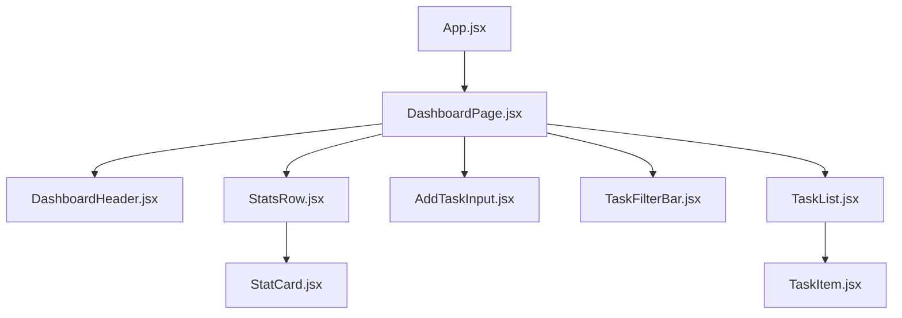

# Changes.md — Refactoring FocusForge Component Architecture

This document details the refactoring process for the **FocusForge** dashboard page. We untangled the monolithic `DashboardPage.jsx` into a clean, modular, and component-based structure, separating single-responsibility UI elements into reusable (`shared/`) and page-specific (`dashboard/`) components.

---

## 1. Architectural Component Map
By analyzing the layout of the initial dashboard, the UI was decoupled into the following modular tree structure:

---

## 2. Component Design Specifications

### 📁 Reusable Shared Components (`src/components/shared/`)
These components have no knowledge of the dashboard domain context. They can be safely reused across any page of the FocusForge application.

#### 1. `StatCard.jsx`
*   **Responsibility**: Renders a standardized numeric KPI card displaying a value, a label, an optional subtitle, and customizable text color. It also accepts any arbitrary nested `children` (such as a progress bar component) to inject inside the card layout.
*   **Props Accepted**:
    *   `label` (string, required): The stat description, rendered in uppercase format (e.g. "Total Tasks").
    *   `value` (number | string, required): The main metric indicator.
    *   `subtitle` (string, optional): Supplementary description at the base of the card.
    *   `valueColor` (string, optional): Tailwind-like hex code override for the value text (defaults to `#e2e8f0`).
    *   `children` (React Node, optional): Dynamic slot to inject structural content (e.g. progress bar).

#### 2. `TaskItem.jsx`
*   **Responsibility**: Visual representation of a single task entity card, incorporating interactive toggle checkbox, title strike-through on completion, color-coded priority indicators, tag markers, and delete operations.
*   **Props Accepted**:
    *   `task` (object, required): The raw task model shape containing: `{ id, title, completed, priority, tag }`.
    *   `onToggle` (function, required): Callback triggered when the checkbox button is checked.
    *   `onDelete` (function, required): Callback triggered when the "✕" button is clicked.

---

### 📁 Page-Specific Components (`src/components/dashboard/`)
These components are dedicated explicitly to the Dashboard layout and workflows. They organize and style dashboard-specific UI configurations.

#### 3. `DashboardHeader.jsx`
*   **Responsibility**: Top navigation bar containing the FocusForge branding, lightning logo, and profile initial bubble.
*   **Props Accepted**:
    *   `userName` (string, optional): Welcome greeting text (defaults to "Good morning 👋").
    *   `userInitials` (string, optional): Two-character avatar placeholder (defaults to "JD").

#### 4. `StatsRow.jsx`
*   **Responsibility**: Composes four isolated `StatCard` instances into a grid representing: Total, Completed, Remaining, and Progress. Renders a custom linear-gradient progress bar inside the progress card slot.
*   **Props Accepted**:
    *   `totalCount` (number, required): Total orders or tasks in database.
    *   `completedCount` (number, required): Completed subset count.
    *   `remainingCount` (number, required): Pending task count.
    *   `progressPercent` (number, required): Percent calculation (0-100) to feed into the progress bar width style.

#### 5. `AddTaskInput.jsx`
*   **Responsibility**: Text field container for entering a new task with active button and keyboard trigger listeners.
*   **Props Accepted**:
    *   `value` (string, required): The controlled text state for the new task title.
    *   `onChange` (function, required): Handler state updater for keyboard text changes.
    *   `onAdd` (function, required): Action execution callback to submit the input value.

#### 6. `TaskFilterBar.jsx`
*   **Responsibility**: Renders tab select triggers (All, Active, Completed) alongside the keyword search box.
*   **Props Accepted**:
    *   `filter` (string, required): Selected tab state.
    *   `onFilterChange` (function, required): Handler to change active tab select.
    *   `searchQuery` (string, required): The query string in search box.
    *   `onSearchChange` (function, required): Keyboard query state updater.

#### 7. `TaskList.jsx`
*   **Responsibility**: Maps and renders collection lists using `TaskItem.jsx` or handles empty state fallbacks with interactive guidance if task array is empty.
*   **Props Accepted**:
    *   `tasks` (array of objects, required): Array of task items to render.
    *   `onToggle` (function, required): Callback passed down to task items.
    *   `onDelete` (function, required): Delete callback passed down to task items.

---

## 3. DashboardPage.jsx — The Orchestrator
The root page file `DashboardPage.jsx` has been cleanly minimized to focus exclusively on:
1.  **State Management**: Holds task lists, input buffers, filter targets, and search queries.
2.  **Logic & Handlers**: Manages functions for adding, toggling, and deleting tasks.
3.  **Derived Values**: Calculates counts, remaining metrics, progress values, and performs the multi-stage filter and search keyword evaluations.
4.  **Composition**: Structures child components, passing exactly what is required and keeping layout concerns out of logic files.

---

## 4. Scalability Analysis: If FocusForge were 10× Larger

If FocusForge scaled to a massive multi-module production app, we would make the following adjustments to prevent bottlenecking:

1.  **Introduce Centralized State Management**:
    Instead of drilling props down, we would introduce a global store like **Redux Toolkit** or **Zustand** to hold lists and state changes. This avoids prop-drilling across deep hierarchies and ensures other modules (e.g. notifications, profiling) have direct, predictable access.
2.  **Establish absolute CSS modules or Styled Components**:
    Inline styles would quickly become difficult to maintain. Using CSS Modules (`.module.css`) or CSS-in-JS guarantees complete namespace isolation, keeping the styling highly responsive and avoiding layout conflicts.
3.  **Apply Code Splitting and Lazy Loading**:
    Large views would be loaded dynamically via `React.lazy()` and `<Suspense>` wrapper boundaries, allowing Vite to compile smaller, modular chunk payloads and drastically lowering page loading speeds.
4.  **Establish a Robust UI Package**:
    Generic shared components (like `StatCard`) would be migrated to a dedicated design system package (e.g. using Storybook) to unify B2B designs and ensure complete reusability across multiple subdomains and dashboards.
5.  **Utilize Database Pagination and API Filtering**:
    Rather than performing filter and search evaluations on client-side state (`taskList.filter`), we would query the backend API using offset pagination and search queries to handle millions of tasks efficiently without causing browser performance degradation.
